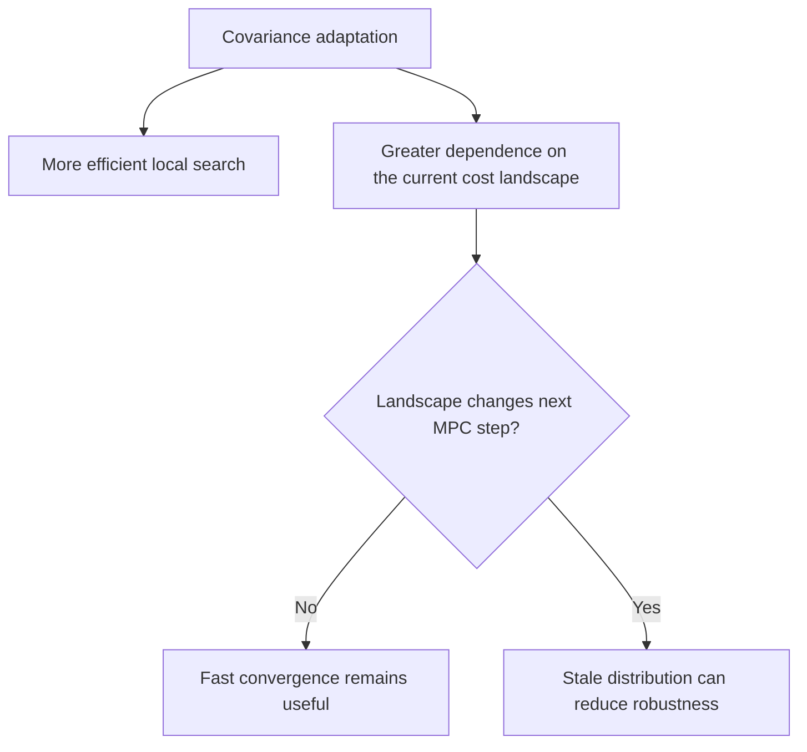

# Covariance Design for Sampling-Based MPC

> When does faster per-step optimization make closed-loop control less stable?

This AERO 740 research project compares three covariance strategies for sampling-based model predictive control: **MPPI**, **DIAL-MPPI**, and **CMA-MPPI**. The central result is not simply that one optimizer wins. In contact-rich dexterous retargeting, the method with the strongest local convergence can be less robust when the cost landscape changes between MPC steps.


## Research question

Sampling-based MPC depends strongly on how its proposal covariance explores the control space. This project asks:

> How should covariance adapt when the optimization dimension is high and the objective changes across closed-loop contact interactions?

| Method | Covariance strategy | Expected behavior |
|---|---|---|
| **MPPI** | Fixed isotropic covariance | Simple and consistent exploration |
| **DIAL-MPPI** | Scheduled isotropic covariance, reset at each MPC step | Broad exploration followed by local refinement |
| **CMA-MPPI** | Learned anisotropic covariance | Faster adaptation along promising control directions |

## Experimental scope

The methods were evaluated progressively on:

1. finite-horizon linear-quadratic regulation;
2. nonlinear spacecraft attitude control; and
3. contact-rich dexterous retargeting with **SPIDER**, **GigaHand** tasks, and GPU-parallel **MuJoCo** rollouts.

The dexterous setting uses a 192-dimensional control vector, 1,024 sampled trajectories, a horizon of 320, and 32 optimizer iterations per MPC step.

## Main finding

**CMA-MPPI produced the strongest per-step convergence by learning directional covariance, while DIAL-MPPI gave the most stable closed-loop dexterous execution.**

The distinction matters because a covariance estimate can be useful for the current MPC subproblem but stale after the system advances. When contact conditions and the local objective change, carrying an aggressively adapted distribution forward can cause drift or reward collapse. DIAL-MPPI avoids part of this failure mode by restarting its exploration schedule at every MPC step.



This suggests a hybrid direction: retain CMA-style anisotropic adaptation within an MPC step, but periodically or partially reset covariance across steps.

## Selected results

For DIAL-MPPI, the final object-position errors in three GigaHand sequences were:

| Sequence | Final position error |
|---|---:|
| `p36-tea` | 0.095 m |
| `p44-dog` | 0.014 m |
| `p52-instrument` | 0.035 m |

The three optimizers had similar runtime in the high-dimensional benchmark—the total runtime differed by less than 8%—because GPU physics rollout dominated the computation. This makes the convergence and stability behavior more important than small optimizer-overhead differences in this setting.

Existing per-task plots and experiment summaries are available in [`spider/outputs/multi_task/comparison`](spider/outputs/multi_task/comparison). The repository also contains implementation notes covering the environment, theory, architecture, visualization, and experiments in [`notes`](notes).

## Repository map

```text
notes/       research notes and experiment design
viz/         analysis and visualization scripts
logs/        development records
spider/      experimental code and outputs
```

## Scope and attribution

This is a course research project and software study; it does not claim real-robot validation. The dexterous experiments build on [SPIDER](https://github.com/facebookresearch/spider), and the included upstream-derived material remains subject to its original attribution and license terms.
